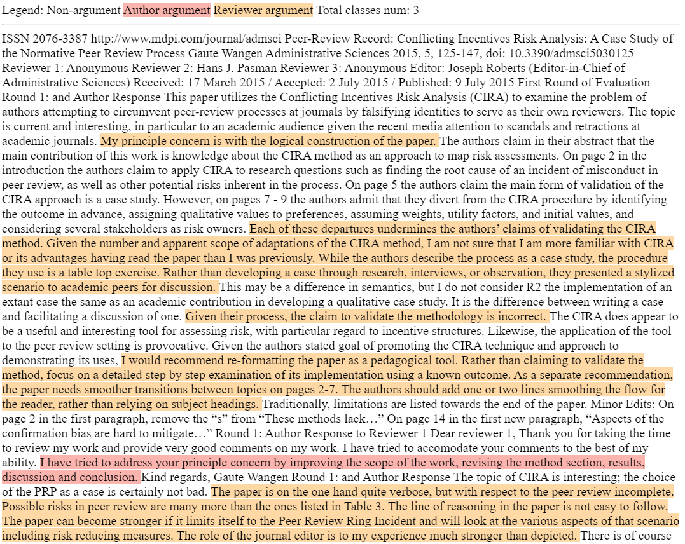

# mdpi_argumentations

## Description

- Total number of reviews: 115
- Each review has been annotated two times by different annotators.
- Total number of annotations: 164

## Structure

{article_review_name}.txt - file with collected text from all files from the review
{article_review_name}_{reviewer}.tsv - file with annotation of the review

### Annotation structure (*.tsv)

Stores all sentences from the review. If sentence is not a review, then all columns will be None except _ann_ and _text_

| Column name | Description                                                |
|-------------|------------------------------------------------------------|
| side        | side of the argument.                                      |
| opponent    | opponent of the argument.                                  |
| round       | Number of round                                            |
| number      | Number of argument in the round                            |
| attacks     | Number of attacking argument from the previous round       |
| ann         | Type of argument (0-not an argument, 1-author, 2-reviewer) |
| text        | Text of argument\sentence                                  |

## Visualization

You can use save_annotated_text_html func from [./src/utils.py](./src/utils.py)

Example of result represented in [./assets/admsci5030125_boyarkin.html](./assets/admsci5030125_boyarkin.html):

## Statistics

Krippendorff's alpha for the dataset is _0.81±0.19_ [[link]](https://en.wikipedia.org/wiki/Krippendorff%27s_alpha) 